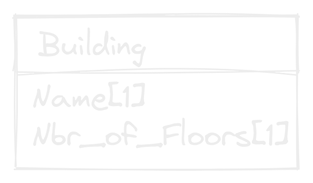
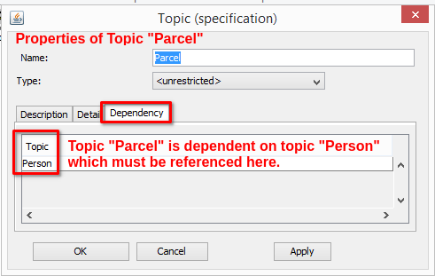
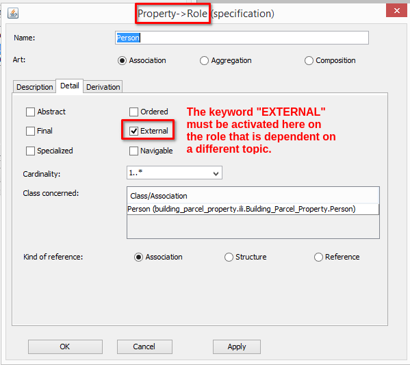
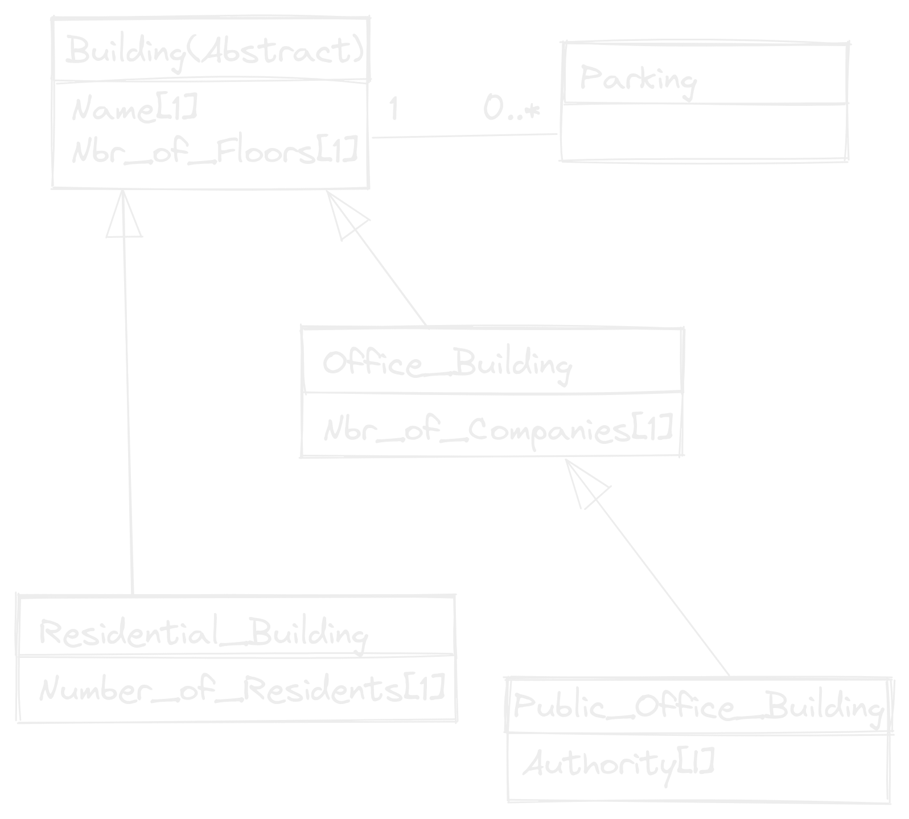
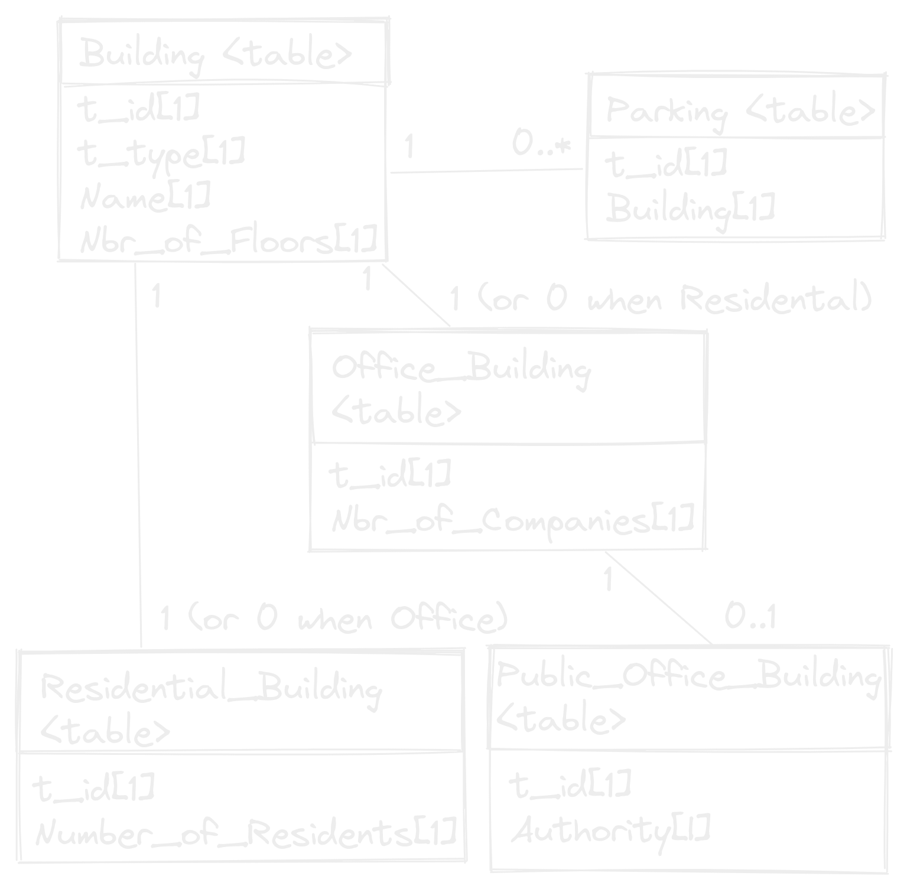
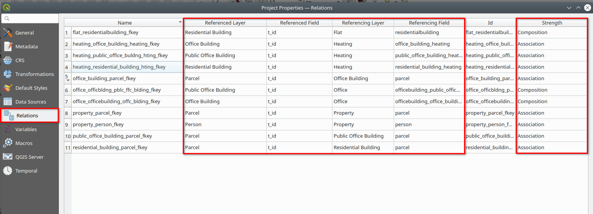
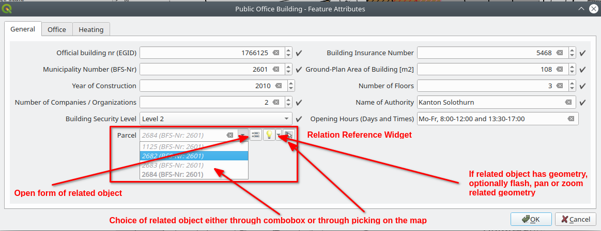
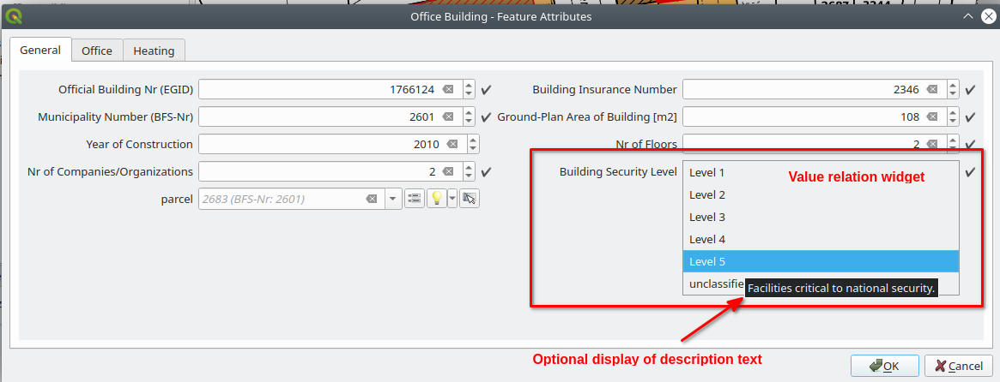
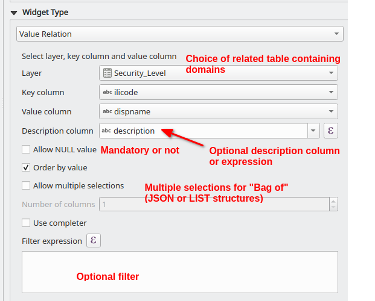
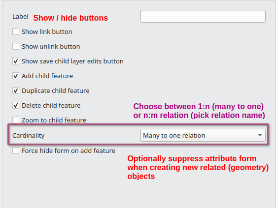

# <!--fit--> INTERLIS Relations in QGIS

How INTERLIS associations and inheritances are handled as QGIS relations

---

# Andreas Neumann
#### Kanton Solothurn
QGIS PSC Member
QGIS Power User
QGIS Model Baker Group
# David Signer
#### OPENGISch
Software Engineer
QGIS Core Comitter
QGIS Model Baker Coordinator


---

# Workshop
- INTERLIS Classes
- INTERLIS Associations
- Check the INTERLIS Model
- Inheritance in Physical Models
- Associations in QGIS
- Widgets for handling relations in QGIS

---

# INTERLIS Classes


---

## Classes
**Syntax**
```
ClassDef =  'CLASS' Class-Name '='
                { AttributeDef }
            'END' Class-Name ';'.
```
**Example**
```   
CLASS Building =
    Name : TEXT*20;
    Nr_of_Floors : MANDATORY 1 .. 100;
END Building;
```
---
## Structures
**Syntax**
```
StructureDef =  'STRUCTURE' Struct-Name '='
                    { AttributeDef }
                'END' Struct-Name ';'.
```
**Example**
```
STRUCTURE Address =
    StreetName : TEXT*40;
    Number : TEXT*12;
END Address;
```
---
## Types of classes
- Concrete
- Abstract
- Final
- Derivate/Extended
---
## Concrete Classes
```
CLASS Building =
    Name : TEXT*20;
    Nr_of_Floors : MANDATORY 1 .. 100;
END Building;

CLASS Office_Building
    EXTENDS Building =
    Nr_of_Companies : MANDATORY 1 .. 200;
END CLASS Office_Building;
```
---

## Abstract Classes
```
CLASS Building (ABSTRACT) =
    Name : TEXT*20;
    Nr_of_Floors : MANDATORY 1 .. 100;
END Building;

CLASS Office_Building
    EXTENDS Building =
    Nr_of_Companies : MANDATORY 1 .. 200;
END CLASS Office_Building;
```
---

## Final Classes
```
CLASS Building (FINAL) =
    Name : TEXT*20;
    Nr_of_Floors : MANDATORY 1 .. 100;
END Building;

CLASS Office_Building
    EXTENDS Building =
    Nr_of_Companies : MANDATORY 1 .. 200;
END CLASS Office_Building;
```
```
!! Error: Building cannot be extended
```
---
## Extending Structures
```
STRUCTURE AddressBase (ABSTRACT) =
    StreetName : TEXT*40;
    Number : TEXT*12;
END AddressBase;

CLASS Address
    EXTENDS AddressBase =
    PLZ : TEXT*6;
    Remarks : TEXT;
END CLASS Address;
```
---

# INTERLIS Associations


---

## Cardinality

### one-to-many
A building belongs to **exactly one** parcel. A parcel **can** have **multiple** buildings.

```
ASSOCIATION =
    local_buildings -- {0..*} Building;
    parcel -- {1} Parcel;
END;
```
### many-to-many
A parcel is owned by **at least one** person. A person **can** own parts of **multiple** parcels.

```
ASSOCIATION Property =
    Person -- {1..*} Person;
    Parcel -- {0..*} Parcel;
END;
```
---

## Strength
- Association `--`: Relationship between independent objects. 
- Aggregation `-<>`: Relationship between parts and a whole. A part can be part of multiple wholes.
- Composition `-<#>`: Relationship between parts and a whole. A part can only be part of a single whole.

<!-- **aggregation** all ascribed parts are automatically copied when copying the entity, however when
deleting the entity the corresponding parts **remain untouched**. Compared to an aggregation you will
find that a **composition** further implies, that when deleting the entity **all parts are deleted** at the
same time.-->
---

## Attributes
An association can contain attributes as well.
```
ASSOCIATION Property =
    Person -- {1..*} Person;
    Parcel -- {0..*} Parcel;
    Ownership_Share : 0 .. 100;
END;
```
---
## Structures

```
STRUCTURE Address =
    StreetName : TEXT*40;
    Number : TEXT*12;
END Address;

CLASS Building =
    Position : Address;
END Building;
```
Possible to use with `LIST` or `BAG .. OF`
```
CLASS Building =
    Position : BAG {0..*} OF Address;
END Building;
```
---

## Cross Topic Associations (1)
A topic that references a class from another topic must have a dependency on the other topic. In the association, one has to use the keyword "EXTERNAL".
```
  TOPIC Parcel =
    DEPENDS ON Building_Parcel_Property.Person;

    ASSOCIATION Property =
      Person (EXTERNAL) -- {1..*} Building_Parcel_Property.Person.Person;
      Parcel -- {0..*} Parcel;
      property_type : MANDATORY Building_Parcel_Property.Property_Type;
      ownership_share : MANDATORY 0 .. 100 [Units.Percent];
    END Property;
```

---

## Cross Topic Associations (2)
Cross topic associations in UML-Editor:





---

# Example Model [`Building_Parcel_Property`](./model/building_parcel_property.ili)


<!-- Go through the ili model -->
---

# The model in QGIS
- ili2db creates the physical Database
- QGIS Model Baker generates the project
- With UsabILIty Hub preconfigured Settings and Stylings can be received from the Repository
---

# Inheritance mapping
- New Class
- Super Class
- Sub Class
- New+Sub Class

---

## Sample Model



<!-- Mention that Parking is not Parcel -->

---
## New Class (1)



---
## New Class (2)
```
Building.t_type: (
    Residental_Building,
    Office_Building,
    Public_Office_Building
)
```
- Specializations are mapped as associations
- Multiple inserts and updates required per object
- Not null attributes can be setted


---

## Super Class
```
Building.t_type: (
    Residental_Building,
    Office_Building,
    Public_Office_Building
)
```
- Missing not null constraints
- Less tables and associations (easy to use)


---

## Sub Class
```
Public_Office_Building.t_type: (
    Office_Building,
    Public_Office_Building
)
```
- Missing not null constraints


---

## New + Sub Class
- IMO the expected behavior
- Missing not null constraints


---

# Smart Mapping in ili2db

---

## noSmartMapping

- All classes are mapped using *New Class* strategy

<!-- Maybe graphic how it looks like -->
---

## smart1Inheritance

- Abstract classes without associations -> *Sub Class* strategy
- Abstract classes with associations and no concrete super class -> *New Class* strategy
- Concrete classes without concrete super class -> *New Class* strategy
- All other classes -> *Super Class* strategy

Means in our example the `Building` uses *New Class* and all others *Super Class* strategy. This results in what we see in the *Super Class* graphic.

---

## smart2Inheritance
-  Abstract classes -> *Sub Class* strategy
-  All concrete classes  -> *New + Sub Class* strategy

Means in our example the `Building` uses *Sub Class* and all other *New+Sub Class*. This results in what we see in the *New+Sub Class* graphic.

---

# Relations in QGIS

## Relation Management in QGIS
-  Relations can be added or removed in menu "Project" --> "Properties" --> "Relations".
-  QGIS ModelBaker generates the relations automatically from you, derived from the Interlis model (through ili2pg)
-  Unfortunately, already existing relations cannot be change anymore (e.g. changing the strength)



---

## Relation Management in QGIS
QGIS offers the followin widgets suitable for managing related classes
-  "Relation Reference" Widget (combobox), suitable for n:1 (or 1:1) relations.
    -  Example: Building matches exactly one parcel.
-  "Value Relation" Widget (combobox), suitable for domains with key/value columns and a description shown with tooltips.
    -  Example: security level of an office building.
- "Relation" Widget (nested embedded form from related table), suitable for 1:n and n:m relations.
    -  Example: One parcel links to many buildings (1:n)
    -  Example: a parcel has multiple owners (n:m), an owner can own multiple parcels.

---

### Relation Reference Widget (1) - Look and Feel
-  For 0..1:n or 1:1 relations
-  Allows to select related features with a combobox displaying an expression with a combination of one or more attributes
-  Choice of related object can be done either with combobox or by clicking a related object on the map
-  Optionally allows to create a new related feature
-  Optionally displays the form of the related feature, either embedded or in a separate window



---

### Relation Reference Widget (2) - Configuration


---

### Relation Reference Widget (3) - Known issues
-  Picking elements on map only works for top-level forms and not for nested forms ;-(

---

### Value Relation Widget (1) - Look and Feel
-  For selecting domain values
-  With key/value pairs
-  Optionally display a description of the value in a tooltip



---

### Value Relation Widget (2) - Configuration



---

### Relation Widget (1) - Look and Feel
-  For 1:n and n:m relations
-  With embedded form and side list panel to step through related objects
-  for n:m relations the in between table can be hidden if there are no attributes on the association


---

### Relation Widget (2) - Configuration



---

### Relation Widget (3) - Link/unlink vs Add/Remove/Duplicate
-  Link and Unlink better suited for "Associations" (low strength)
-  Add/Remove/Duplicate better suited for "Aggregations" and "Compositions" (higher strength)

---

### Relation Widget (4) - Cardinality
-  For 1:n relations: choose "Many to one relation"
-  For n:m relations: choose "Class Name (Primary Key)", e.g. "Person (t_id)" on both ends of the relation to hide the in-between table

---

### Relation Widget (5) - Known issues
-  Update issues in side list panel when data changes in a child form
-  Multiple nested forms (xx-levels deep)

---

## Cascading Deletion of related objects

### Cascading Deletion in QGIS
-  For Aggregation and Compositions: QGIS asks if you want to deletes related objects 
-  For Assocations you have to first unlink related objects before removing and object that contains references
-  Referenced structures: treated like Assocations, you also manually need to unlink objects first

---

### Cascading Deletion in Postgis
-  use ON UPDATE and ON DELETE rules
-  Possible values: "RESTRICT", "NO ACTION", "SET NULL", "SET DEFAULT" and "CASCADE"

```
ALTER TABLE building_parcel_property_smart2.heating
DROP CONSTRAINT heating_office_building_heating_fkey;

ALTER TABLE building_parcel_property_smart2.heating
  ADD CONSTRAINT heating_office_building_heating_fkey FOREIGN KEY (office_building_heating)
 REFERENCES building_parcel_property_smart2.office_building(t_id) 
 ON UPDATE RESTRICT ON DELETE CASCADE
 DEFERRABLE INITIALLY DEFERRED;

```
